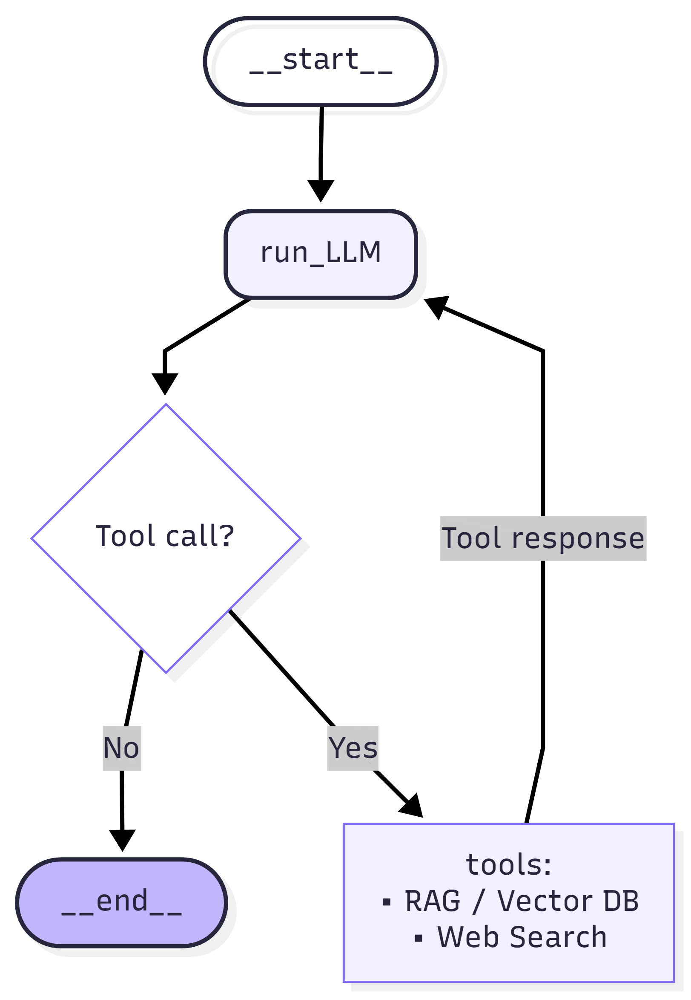

# Yandex-Map-Agent
[](https://www.python.org/downloads/)
[](https://python.langchain.com/)
[](https://docs.langchain.com/oss/python/langgraph/overview)


Проект по созданию LLM‑агента, который оценивает релевантность организаций на Яндекс.Картах широким рубричным запросам (например, «ресторан с верандой» или «романтичный джаз‑бар»). Агент должен сам находить необходимые данные и принимать решение о релевантности.

Данные предоставлены Яндексом и содержат ассессорскую разметку релевантности.

**Что внутри**
1. Агент на LangGraph с LLM через OpenAI‑compatible API.
1. Инструмент поиска Tavily.
1. FAISS‑ретривер примеров на эмбеддингах `ai-forever/FRIDA`.
1. Базовый скрипт TF‑IDF + CatBoost.


**Данные и постановка**
- Цель: предсказать `relevance` по всем остальным полям организации.
- Метки: `1.0` = `RELEVANT_PLUS`, `0.1` = `RELEVANT_MINUS`, `0.0` = `IRRELEVANT`.
- Метрика: `accuracy` (классы сбалансированы).
- Eval‑множество: 500 объектов, без класса `RELEVANT_MINUS` для простоты.
- Важно: не использовать eval для калибровки/подбора промпта или параметров. Это делается только на train.

**Материалы**
- Статья: https://habr.com/ru/articles/864646/
- Презентация: https://drive.google.com/file/d/1XBvDo_iLs-rs1IzvMgy3ZROE9cYcPSuH/view
- Данные: https://disk.yandex.ru/d/6d5hFHvpAZjQdw

**Структура проекта**
- `src/agent.py` — граф LangGraph, сборка цепочки, запуск LLM‑агента.
- `src/tools.py` — инструменты агента (Tavily Search и FAISS‑retriever).
- `src/faiss_retriever.py` — загрузка индекса, поиск похожих примеров, форматирование выдачи.
- `src/scripts/baseline_tfidf_catboost.py` — baseline: TF‑IDF + CatBoost, обучение и валидация.
- `src/scripts/make_faiss_index.py` — построение FAISS‑индекса и метаданных (режимы split/full).
- `src/scripts/run_prediction.py` — запуск экспериментов агента, логирование предсказаний в `logs/agent_runs/`.

<br>
<figure>
  <p align="center">
    
  </p>
  <figcaption align="center">Структура агента</figcaption>
</figure>


**Зачем агенту RAG‑тулза (FAISS-ретривер)**
- Чтобы в сложных или пограничных случаях быстро подтянуть похожие размеченные примеры из трейна и использовать их как калибровку решения. Это снижает риск «галлюцинаций», дает более стабильные решения на неочевидных запросах и помогает придерживаться обученной логики меток. По факту это few‑shot.
- Индекс строится по паре `QUERY + org_text`, где `org_text` включает `CITY` (первый компонент `address`), `normalized_main_rubric_name_ru`, `name`.


**Переменные окружения**
- `OPENAI_BASE_URL` — base URL для OpenAI‑compatible API.
- `OPENAI_API_KEY` — ключ для модели.
- `TAVILY_API_KEY` — ключ для Tavily Search.

**Что было сделано**
1. Разделяю трейновый датасет: 98% — для построения FAISS‑индекса (RAG), 2% — для настройки агента (tune_split).
2. Через GPT‑5.2 thinking выбираю 50 неоднозначных примеров из tune_split и прогоняю 3 стратегии:
- без тулзов (`system_prompt_base.jinja`),
- с редким использованием тулзов (`system_prompt_tools.jinja`),
- с частым использованием тулзов (`system_prompt_tools_2.jinja`).
3. Выбираю лучшую стратегию, строю FAISS‑индекс по 100% трейна и запускаю финальный эксперимент на валидационном сете.
4. Параллельно считаю бейзлайн: baseline_tfidf_catboost.py (baseline.ipynb) на валидации.

**Данные и артефакты**
- `data/raw/data_final_for_dls_new.jsonl` и `data/raw/data_final_for_dls_eval_new.jsonl` — исходные данные.
- `data/raw/data_final_for_dls_eval_new.jsonl` — валидация для экспериментов и baseline.

- `data/artifacts/faiss.index` и `data/artifacts/faiss_meta.json` — индекс и метаданные для retriever.
- `data/artifacts/faiss_split/train_split.jsonl` и `data/artifacts/faiss_split/tune_split.jsonl` — train/tune (98/2) для настройки агента.
- `data/artifacts/faiss_split/tune_split_hard_examples.jsonl`— 50 сложных примеров из tune для тестирования гипотез агента.

- `data/raw/data_final_for_dls_new.jsonl` — 100% трейна для финального индекса.
- `logs/agent_runs/` — логи предсказаний run_prediction.py.


**Скрипты**
Запуск baseline:

```bash
python src/scripts/baseline_tfidf_catboost.py --train-path data/raw/data_final_for_dls_new.jsonl --val-path data/artifacts/val.jsonl
```

Построение FAISS индекса (98/2 для настройки агента):

```bash
python src/scripts/make_faiss_index.py --artifacts-dir data/artifacts/faiss_split --mode split --split-frac 0.98
```

Построение FAISS индекса (100% трейна):

```bash
python src/scripts/make_faiss_index.py --artifacts-dir data/artifacts/faiss_full --mode full
```

Запуск эксперимента агента:

```bash
export FAISS_INDEX_DIR=data/artifacts/faiss_split  
python src/scripts/run_prediction.py --experiment no_tools --sample-size 50
```

Полный прогон на всем val:

```bash
export FAISS_INDEX_DIR=data/artifacts/faiss_full
python src/scripts/run_prediction.py --experiment web_search_rag --use-full
```

## Результаты бейзлайна

- Baseline (TF-IDF + CatBoost, `baseline.ipynb`): val size = 500, accuracy = 0.8700, precision = 0.9013, recall = 0.8927, F1 = 0.8970.

## Эксперименты и результаты LLM-агента

## Что сравнивали
Один и тот же сэмпл из 50 строк прогонялся в 3 режимах, плюс финальный прогон на всей валидации (500 строк):

- **EXPERIMENT_1**: no tools
- **EXPERIMENT_2**: редкое использование тулзов
- **EXPERIMENT_3**: частое использование тулзов
- **FINAL_RUN**: “частые тулзы” на всей валидации

---

## Данные и парсинг
- Парсинг:
  - **EXPERIMENT_1**: parsed_ok **49/50 (0.98)**, bad_parse=1  
    - пример: `row_id=134` (одна из двух строк) — невалидный JSON из-за неэкранированных кавычек в `notes` (`"дод тюмень"`).
  - **EXPERIMENT_2**: parsed_ok **50/50 (1.00)**
  - **EXPERIMENT_3**: parsed_ok **50/50 (1.00)**
  - **FINAL_RUN**: parsed_ok **495/500 (0.99)**, bad_parse=5  
    - все 5 нераспарсенных строк имеют **true_label=1**: `row_id={0,72,342,461,470}`
    - типовые причины:
      - пустой `pred_raw` (`row_id=0,461,470`)
      - ответ остался в виде `<tools>...` без финального JSON (`row_id=72`)
      - невалидный JSON из-за кавычек в `notes` (например, `row_id=342` содержит `"проектная"` без экранирования)

---

## Частота использования тулзов
(доли считаются по распарсенным строкам)

### EXPERIMENT_2 (parsed_ok=50)
- any tool: **4/50 (8.0%)**
- RAG: **4/50 (8.0%)**
- WEB: **1/50 (2.0%)**
- WEB+RAG: **1/50 (2.0%)**

### EXPERIMENT_3 (parsed_ok=50)
- any tool: **20/50 (40.0%)**
- RAG: **19/50 (38.0%)**
- WEB: **3/50 (6.0%)**
- WEB+RAG: **2/50 (4.0%)**

### FINAL_RUN (parsed_ok=495)
- any tool: **49/495 (9.9%)**
- RAG: **36/495 (7.3%)**
- WEB: **14/495 (2.8%)**
- WEB+RAG: **1/495 (0.2%)**

---

## Метрики

### EXPERIMENT_1 (N=50, parsed_ok=49)
- Accuracy: **0.388**
- Macro: F1 **0.375**, Precision **0.375**, Recall **0.380**

### EXPERIMENT_2 (N=50, parsed_ok=50)
- Accuracy: **0.440**
- Macro: F1 **0.417**, Precision **0.419**, Recall **0.427**

### EXPERIMENT_3 (N=50, parsed_ok=50)
- Accuracy: **0.440**
- Macro: F1 **0.436**, Precision **0.436**, Recall **0.436**

### FINAL_RUN (N=500, parsed_ok=495)
- Accuracy: **0.747**
- Macro: F1 **0.743**, Precision **0.747**, Recall **0.765**

---

## Где тулзы помогли / навредили (конкретные примеры)
### Явно помогли (на общем 50-сэмпле; EXP1 ошибся → EXP3 исправил с тулзами)
- `row_id=177` (true=1): **0 → 1** с **RAG**  
  - `used_tools=['retrieve_similar_examples']`, evidence: `prices_summarized: "протезирование на имплантатах"`
- `row_id=474` (true=1): **0 → 1** с **RAG**  
  - `used_tools=['retrieve_similar_examples']`
- `row_id=328` (true=1): **0 → 1** с **RAG+WEB**  
  - `used_tools=['retrieve_similar_examples','tavily_search_results_json']`
- `row_id=63` (true=0): **1 → 0** с **RAG** (снял ложную “привязку” к РЖД)  
  - `used_tools=['retrieve_similar_examples']`

### Навредили (на 50-сэмпле)
- `row_id=613` (true=0): **0 → 1** с **WEB**  
  - `used_tools=['tavily_search_results_json']` → FP на основании внешнего подтверждения (“ставят Чехова”)

### Качество по подмножествам тулзов (FINAL_RUN)
- **RAG-only (n=35)**: Accuracy **0.829**, F1₁ **0.857** (лучшее подмножество)
- **WEB-only (n=13)**: Accuracy **0.385**, F1₁ **0.429** (хуже остальных; WEB чаще приводит к FP)
  - примеры WEB-only FP: `row_id=286` (tavily), `row_id=524` (web_search), `row_id=567` (web_search)

---

## Короткий вывод
- На “сложном” 50-сэмпле тулзы в основном улучшают **качество класса 1** (EXPERIMENT_3: F1₁ 0.391 vs 0.300), но не дают прироста Accuracy (0.44 в EXP2/EXP3).
- На полной валидации FINAL_RUN заметно сильнее по всем ключевым метрикам (Accuracy 0.747, F1₁ 0.777), но есть **узкое место парсинга**: 5/500 без предсказания, и все 5 — true=1 (прямая потеря recall).
- По логам RAG выглядит более “безопасным” и полезным, чем WEB: **RAG-only** подмножество сильно лучше, а **WEB-only** — заметно хуже из-за FP.


## Идеи для улучшения
- В baseline TF-IDF после склейки модель не отличает токены запроса от токенов организации (query vs document). Можно попробовать разделить признаки как `[Xq | Xd | cosine]`
- Снизить число полей, возвращаемых RAG-тулзой для few-shot. Сейчас в каждом возвращаемом примере есть поля: `score`, `train_row_idx`, `permalink`, `label`, `Text`, `city`, `rubric`, `name`. Убрать `train_row_idx`, `permalink`
- Починить парсинг — гарантировать валидный JSON (экранирование кавычек в notes / убрать notes), + авто-ретрай при parse fail.
- RAG-first, web-second — сначала RAG, web только если RAG не дал явного подтверждения.
- Жёстче правила для web — web только “верифицирует” (name+город/адрес/филиал или явный атрибут), не “делает релевантным” → меньше FP.
- Триггеры включения тулзов — вызывать их только при низкой уверенности/транслите/гео-конфликте/филиалах/“рядом/метро”.